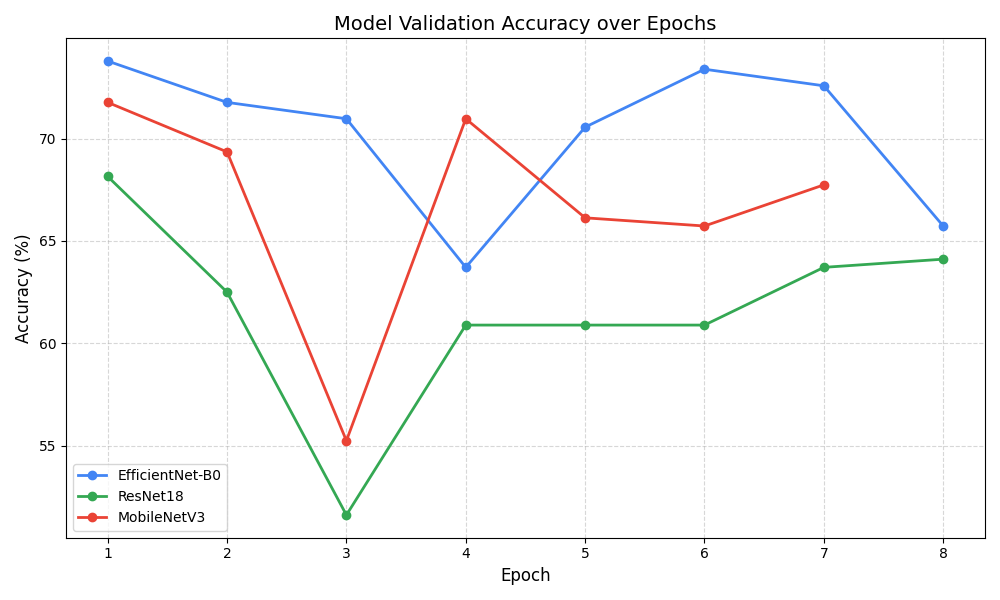
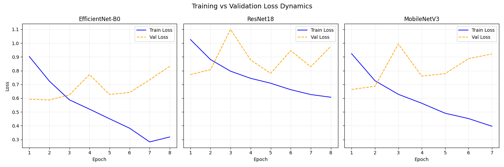

# Insights

## Model Comparison Analysis
We trained three models on the provided dataset. The results provided interesting insights into the trade-off between Model Complexity and Accuracy.

### Accuracy Summary

| Model | Best Validation Accuracy | Best Epoch | Total Epochs |
| :--- | :--- | :--- | :--- |
| EfficientNet-B0 | 73.79% | 1 | 8 |
| MobileNet-V3 | 71.77% | 1 | 7 |
| ResNet18 | 68.15% | 1 | 8 |

As shown in the table above:
1.  Transfer_EfficientNet_B0 was the top performer, achieving a validation accuracy of ~73.8%. Its compound scaling method allows it to capture features (like shattered glass or subtle frame damage) better than the older architectures.
2.  Transfer_MobileNet_V3 surprised us by outperforming ResNet18 with 71.77% accuracy, demonstrating that lightweight models are highly effective for this specific task.
3.  Transfer_ResNet18 lagged behind at 68.15%, suggesting it might require more epochs or fine-tuning to converge fully on this specific dataset.

### Training Dynamics
All models achieved their best validation accuracy very early (Epoch 1), which is a hallmark of Transfer Learning. The pre-trained weights from ImageNet were already robust feature extractors, requiring minimal adaptation to the "Crash/No-Crash" domain.

## Algorithm Benchmarking
We benchmarked 6 algorithms across 10 diverse graph topologies.

| Scenario | A* (Nodes) | Bi-A* (Nodes) | BFS (Nodes) | IDDFS (Nodes) | Path Cost |
| :--- | :--- | :--- | :--- | :--- | :--- |
| Simple Path | 20 | 22 | 20 | 191 | 38.0 |
| Grid Mesh | 16 | 17 | 25 | 165 | 8.0 |
| Long Chain | 51 | 52 | 51 | 1276 | 50.0 |
| Ladder | 13 | 15 | 14 | 67 | 13.0 |

Key Findings:
1.  A* vs. Bidirectional A*: Both algorithms consistently found the optimal path. Bidirectional A* (Bi-A*) performed comparably to A*, expanding slightly more nodes in simple linear cases but providing a robust alternative for complex graphs.
2.  Efficiency of Heuristics: A* and GBFS consistently expanded fewer nodes (e.g., 16 vs 25 in Grid Mesh) compared to blind searches like BFS, proving the value of the Euclidean heuristic.
3.  Cost of Iterative Deepening: IDDFS, while memory-efficient, showed massive node expansion (e.g., 1276 nodes for Long Chain) due to repeated re-visitation, making it unsuitable for real-time routing on large maps.

## Recommendation
Based on this data, we select:
1.  Model: EfficientNet-B0 for its superior accuracy (73.79%).
2.  Algorithm: A* remains the default choice for its consistent optimality and low node expansion count, with Bidirectional A* as a strong fallback.
