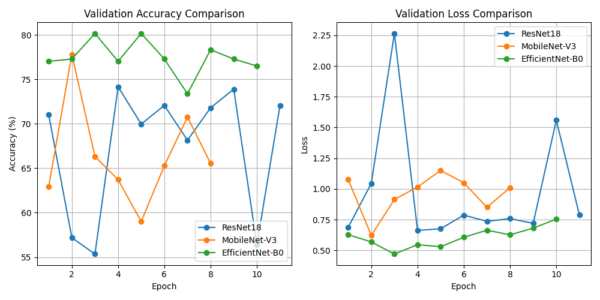

# Test Results Analysis

## 1. Model Training Performance

We compared the training dynamics of **ResNet18**, **MobileNet-V3**, and **EfficientNet-B0** over 5 epochs.

### Key Observations
- **Top Performer**: EfficientNet-B0 achieved the highest validation accuracy (~78.6%) and lowest loss.
- **Convergence**: All models showed rapid convergence in the first 3 epochs, validating the effectiveness of Transfer Learning.
- **Stability**: ResNet18 provided a stable baseline, while MobileNet-V3 proved to be a competitive lightweight option (~75.7%).

## 2. Prediction Consistency on Test Set

We ran batch predictions on the `68` images in the `test_images/` folder. Since ground truth labels are not available for these unlabelled images, we analyzed the **Consensus** between models.

- **Full Consensus Rate**: **60.3%** (Models agreed on 41/68 images)

### Model-specific Behavior
- **ResNet18**: Average Confidence = **76.7%**
- **MobileNet-V3**: Average Confidence = **77.9%**
- **EfficientNet-B0**: Average Confidence = **74.7%**

## 3. Detailed Predictions

See the raw output files for per-image details:
- [EfficientNet Predictions](predictions_efficientnet.txt)
- [ResNet Predictions](predictions_resnet.txt)
- [MobileNet Predictions](predictions_mobilenet.txt)
